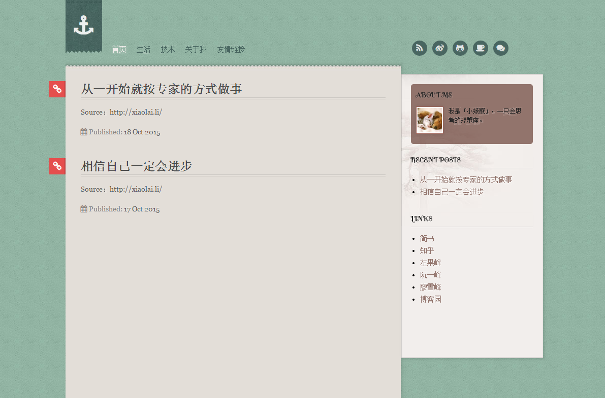

##Kunka

> 这是 Jekyll 主题的博客。



###使用方法

* 把主题文件 clone 到你本地服务器，添加文章到 ```_posts``` 文件夹。
* 修改 ```_config.yml```，里面有很多可以配置的选项。
* 运行 ```jekyll serve```，浏览器打开 http://localhost:4000 便可以看到新的主题。

更多的介绍，详见[Jekyll 博客主题 Kunka](http://www.zhanxin.info/jekyll/2013-08-11-jekyll-theme-kunka.html)。

    shift+down 整行选择
    shift+control+right 下一个教程
    shift+command+up 方法调换位置
    command+control+G 选择多处选中
    if --->command+shift+enter 补全if,有惊喜 自动补全分号，还能格式化
    shift+f6 rename
    command+option+v 提取表达式，用一个变量接受
    command+option+m 提取代码片段为方法
    command+option+l 格式化代码
    String --->command+down  查看string源码
    command+f12 弹窗查看类结构图
    command+G 查找下一个出现该词的地方 
    command+shift+g idea中选中文本google搜索